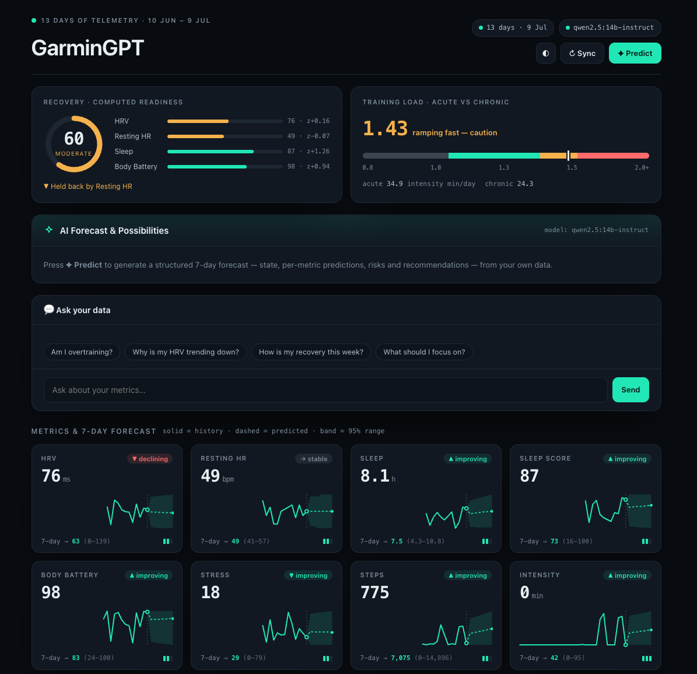

# GarminGPT 🫀

### Your Garmin data, finally with a brain.

An **AI health coach for your Garmin** that predicts your next 7 days, scores your
**recovery**, catches **overtraining before it happens**, and answers questions about
your body in plain English — running **100% on your own laptop**.

**No cloud. No subscription. No account.** Your health data never leaves your computer.



> Like the coaching in **Whoop** or **Oura** — but for the watch you already own, for **free**, and **fully private**.

### What it tells you

- 🔋 **Recovery score** — a real readiness number from your HRV, resting HR, sleep & body battery *(the one Garmin never gave you)*
- 📈 **7-day forecasts** — where every metric is heading, with honest confidence bands
- ⚠️ **Overtraining radar** — acute-vs-chronic training load, so you ease off *before* you break down
- 🧭 **What actually drives your recovery** — it correlates your own behaviours (sleep, stress, training) against next-day HRV & resting HR
- 🧠 **AI predictions & chat** — ask *"am I overtraining?"* and get an answer grounded in **your** numbers, not generic advice
- 🔒 **Private & offline** — a local AI model does all the thinking; nothing is ever uploaded

*Setup is one step and takes a few minutes — see below. Not medical advice.*

> 📱 **On iPhone?** A native on-device app is coming — reads Apple Health (where Garmin deposits your data) and predicts with Apple's on-device model, no laptop needed. See [getvitalocal.com](https://getvitalocal.com).

---

## 🟢 Easiest way — let an AI set it up for you

Not techy? No problem. Open the **Claude app** or the **ChatGPT app** on your laptop
(get it from claude.ai or chatgpt.com if you don't have it), and **paste this in**:

> I want to run an app on my own laptop but I'm not technical. Here is the code:
> **https://github.com/RubenHaisma/garmingpt**
>
> Please read its README, then give me the exact steps for **my** operating system,
> **one at a time**, and wait for me to tell you each one worked before giving the next.
> It needs a thing called "Ollama" and Python — if either is missing, walk me through
> installing it. When it's finally running, tell me to open **http://127.0.0.1:8800**
> in my browser, where I'll sign in to my Garmin. If any step shows an error, ask me to
> paste the error back and fix it.

The AI will hold your hand through the whole thing and fix anything that breaks. 👍

---

## 🔵 Or install it yourself — one step

**One script installs _everything_** — Ollama (the local AI), Python, the AI model — and launches the app. You don't need anything set up first.

**Fastest (Mac/Linux):** open **Terminal** and paste this one line:

```bash
curl -fsSL https://raw.githubusercontent.com/RubenHaisma/garmingpt/main/install.sh | bash
```

**Or double-click** (first download the code: green **Code** button ▸ **Download ZIP** ▸ unzip):

- **Mac:** double-click **`start.command`**
  *(If macOS says "unidentified developer": right-click it → **Open** → **Open**. Only once. If double-click does nothing after a ZIP download, use the one-line command above instead.)*
- **Windows:** double-click **`Start GarminGPT.bat`**

The first run takes a few minutes (one ~2 GB download), then your browser opens.
**Sign in to your Garmin on that page** and you're done.

To stop: close the black window. To use it again: run the same file (instant after the first time).

---

## What it needs

- A **Mac or Windows laptop**, ideally ~8 GB RAM and a few GB of free disk space.
- Your **Garmin Connect** email + password (and your phone, if you use two-factor codes).
- An internet connection **for the first setup only** (to download the AI). After that it runs offline.

Everything else — Ollama (the local AI), Python, and a small AI model — installs itself.

## What you get

- **Recovery score** (a readiness number built from your HRV, resting HR, sleep & body battery)
- **Training load** (are you ramping up too fast?) and **what drives your recovery**
- Every metric with a **7-day forecast**
- An **AI forecast** (state, predictions, risks, recommendations) and a **chat** that answers
  questions about *your* numbers — all from a model running on your own machine

---

## 🤖 For the AI assistant helping to set this up

You are helping a **non-technical person** run this local app. Be patient, give one command
at a time, explain what each does in a sentence, and ask them to paste back any error.
The end state: the app is serving on `http://127.0.0.1:8800` and they log in via the browser.

**What this is:** a Python (managed by `uv`) FastAPI web app that reads the user's Garmin data
via `python-garminconnect`, computes forecasts + analytics locally, and uses a local **Ollama**
model for predictions and chat. Entry point: `uv run python -m garmingpt serve` (binds 127.0.0.1:8800).

**The simplest path is to just run the launcher** — `./start.command` (macOS) or
`Start GarminGPT.bat` (Windows). It does everything below. Only fall back to manual steps if it fails.

**Manual setup (do these in order):**

1. **Install `uv`** (installs Python + deps; no system Python needed):
   - macOS/Linux: `curl -LsSf https://astral.sh/uv/install.sh | sh` then add `~/.local/bin` to PATH.
   - Windows (PowerShell): `irm https://astral.sh/uv/install.ps1 | iex`
2. **Install dependencies:** from the project folder, `uv sync`.
3. **Install Ollama** (the local AI engine): https://ollama.com/download — macOS/Windows have installers; Linux: `curl -fsSL https://ollama.com/install.sh | sh`.
4. **Start Ollama** if it isn't running: `ollama serve` (the macOS app starts it automatically).
5. **Pull a small model** that fits the machine (≈2 GB): `ollama pull qwen2.5:3b`
   (on a low-RAM machine use `ollama pull llama3.2:1b` instead).
6. **Run the app:** set `GARMINGPT_MODEL` to the model you pulled, then `uv run python -m garmingpt serve`.
   e.g. macOS/Linux: `GARMINGPT_MODEL=qwen2.5:3b uv run python -m garmingpt serve`
7. Tell the user to open **http://127.0.0.1:8800** and sign in to Garmin there (email + password,
   plus a 2-factor code if prompted). The first data sync takes a minute or two.

**Config / knobs:** `GARMINGPT_MODEL` picks the Ollama model; `OLLAMA_HOST` overrides the Ollama
URL (default `http://localhost:11434`). No API keys, no cloud, no accounts to create.

**Common issues:**
- *macOS "unidentified developer" on start.command* → right-click → Open → Open (once).
- *Ollama "cannot be opened"* → `xattr -dr com.apple.quarantine /Applications/Ollama.app`.
- *Garmin login returns 429 / rate-limited* → tried too many times; wait 15–60 min and retry. The login uses `python-garminconnect`'s browser-impersonation, so it's not the code.
- *"ollama offline" pill in the app* → the Ollama server isn't running; run `ollama serve`.
- *Predictions are slow* → normal on small machines; the 3B model takes ~20–40 s. It's local, not the cloud.
- *Empty tiles / "insufficient data"* → the watch wasn't worn enough days; that's honest, not a bug. This app never invents data.

---

## For developers

```bash
uv sync
uv run python -m garmingpt serve            # dashboard at http://127.0.0.1:8800
# other commands:
uv run python -m garmingpt login            # terminal Garmin login (the web form is easier)
uv run python -m garmingpt dashboard        # pull data → dashboard_data.json (the app's Sync button does this)
```

Project layout:

```
start.command · Start GarminGPT.bat · install.sh   ← one-click launchers
docs/dashboard.png                                 ← README screenshot
garmingpt/                                          ← the package
├── __main__.py        → python -m garmingpt …
├── cli.py             CLI (login / dashboard / serve …)
├── garmin_client.py   Garmin auth via garminconnect/curl_cffi (+ web login)
├── dashboard.py       pull & normalise Garmin data
├── forecast.py        trend + confidence-band forecasts
├── analytics.py       recovery score · ACWR training load · driver correlations
├── insights.py        Ollama structured output + chat
├── serve.py           FastAPI app + endpoints
├── static/index.html  the dashboard UI
└── legacy/            older morning-briefing validation slice
```

Personal data (`dashboard_data.json`, `~/.garmingpt/tokens/`) never leaves the machine and is gitignored.

*Built for personal use with your own watch data. Not medical advice.*
